# IZB Test Suite

Skripte zum Testen der N8N und Make Workflows.

## Quick Start

```bash
# Skripte ausführen
python create_test_data.py
python fill_form.py
python delete_test_data.py

# HTML-Dokumentation generieren
python generate_docs.py
open docs.html
```

## Prozessübersicht

```mermaid
flowchart TD
    subgraph prod["Produktiver Ablauf"]
        P1["Applikationsformular"] --> P2["Dokumente anlegen"]
        P2 --> P3["PandaDoc erstellen"]
        P3 --> P4["Kunde unterschreibt"]
        P4 --> P5["QCG Auftrag starten"]
    end

    subgraph test["Test-Simulation"]
        T1["create_test_data.py"] --> T2["fill_form.py"]
        T2 --> T3["trigger_document_creation.py"]
        T3 --> T4["simulate_pandadoc_signed.py"]
        T4 --> T5["delete_test_data.py"]
    end
```



## Skripte

| Skript | Beschreibung | Doku |
|--------|--------------|------|
| `create_test_data.py` | Testdaten in Airtable erstellen | [Details](docs/scripts/create_test_data.md) |
| `fill_form.py` | Formular automatisch ausfüllen | [Details](docs/scripts/fill_form.md) |
| `trigger_document_creation.py` | N8N Webhook triggern | [Details](docs/scripts/trigger_document_creation.md) |
| `simulate_pandadoc_signed.py` | PandaDoc-Unterschrift simulieren | [Details](docs/scripts/simulate_pandadoc_signed.md) |
| `delete_test_data.py` | Testdaten löschen | [Details](docs/scripts/delete_test_data.md) |
| `find_and_delete_test_data.py` | Testdaten suchen & löschen | [Details](docs/scripts/find_and_delete_test_data.md) |
| `get_close_leads.py` | Close CRM Leads suchen | [Details](docs/scripts/get_close_leads.md) |
| `make_queue_webhook_rerun.py` | Webhook manuell aufrufen | [Details](docs/scripts/make_queue_webhook_rerun.md) |

## Dokumentation

- [Prozessdiagramm](docs/PROCESS_FLOW.md) - Detaillierte Visualisierung
- [docs/scripts/](docs/scripts/) - Dokumentation pro Skript

## Setup

```bash
pip install -r requirements.txt
playwright install chromium  # Für fill_form.py
```

## Environment Variables

Erstelle `.env`:
```
AIRTABLE_TOKEN=pat...
AIRTABLE_BASE_ID=app...
CLOSE_API_KEY=Basic ...
```
