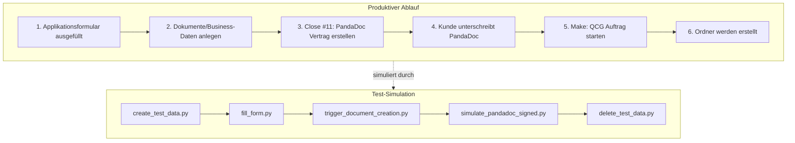
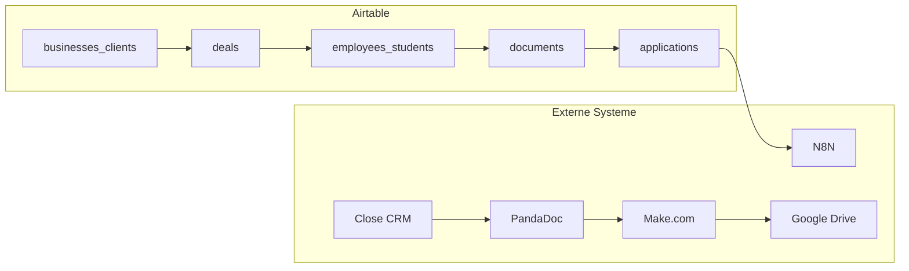

# Prozessübersicht

## Gesamtablauf

## Datenfluss

## Skript-Zuordnung

| Produktions-Schritt | Test-Skript | Beschreibung |
|---------------------|-------------|--------------|
| Applikationsformular | `fill_form.py` | Füllt das Formular automatisch aus |
| Daten anlegen | `create_test_data.py` | Erstellt Testdaten in Airtable |
| Dokumente generieren | `trigger_document_creation.py` | Triggert N8N Webhook |
| PandaDoc unterschrieben | `simulate_pandadoc_signed.py` | Simuliert Webhook-Event |
| Aufräumen | `delete_test_data.py` | Löscht Testdaten |
