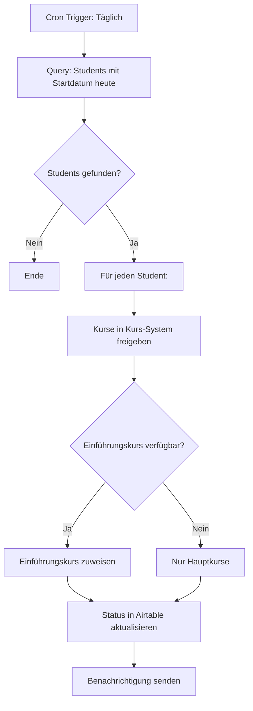

# activate_courses_on_start_date.py

Gibt Kurse automatisch für Students frei, wenn deren Startdatum erreicht ist.

## Kontext

Nach der Weiterleitung an MANAVA werden Kurse nicht sofort freigegeben.
Dieser Workflow läuft täglich und prüft, welche Students heute ihr Startdatum haben.

## Trigger

- **Scheduled:** Tägliche Ausführung (z.B. 06:00 Uhr)
- **N8N Cron:** `0 6 * * *`

## Eingaben

### Airtable Query
| Tabelle | Filter |
|---------|--------|
| `employees_students` | `start_date = TODAY()` AND `manava_status = "pending"` |

## Ablauf



## Ausgaben

### Kurs-System
- Kurse werden für Student freigeschaltet
- Optional: Einführungskurs "Wie funktioniert alles nochmal?" zugewiesen
  - *[Hinweis: Dieser Kurs existiert noch nicht]*

### Airtable Updates
| Tabelle | Felder |
|---------|--------|
| `employees_students` | `manava_status = "active"`, `courses_activated_at` |

### Benachrichtigungen
- E-Mail an Student: "Deine Kurse sind jetzt verfügbar"
- Optional: Slack-Benachrichtigung an Team

## Kurs-System Integration

*[TODO: Kurs-System noch zu klären]*

Mögliche Systeme:
- MANAVA-Plattform API
- Externes LMS (Moodle, etc.)
- Custom API

## API-Aufrufe

### Airtable Query
```
GET https://api.airtable.com/v0/{base_id}/employees_students
?filterByFormula=AND({start_date}=TODAY(),{manava_status}="pending")
```

### Kurs-Freigabe (Beispiel)
```
POST https://manava-api.../activate-courses
Content-Type: application/json

{
  "student_id": "...",
  "course_ids": ["...", "..."]
}
```

## Geplante Erweiterungen

- [ ] Einführungskurs "Wie funktioniert alles nochmal?" erstellen
- [ ] Kurs-System API Integration spezifizieren
- [ ] Fehlerbehandlung für fehlgeschlagene Aktivierungen

## Beispiel

```bash
python activate_courses_on_start_date.py
```

## Vorheriger Schritt

← `forward_to_manava.py`
