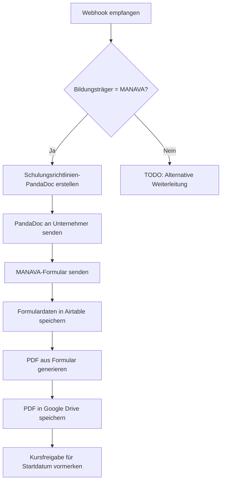

# forward_to_manava.py

Leitet akzeptierte Mitarbeiter/Students an MANAVA weiter und initiiert die Schulungsvorbereitung.

## Kontext

Nach Akzeptierung eines Mitarbeiters wird dieser Workflow ausgelöst:
1. Schulungsrichtlinien-Dokument wird erstellt und zur Unterschrift gesendet
2. MANAVA-Formular wird ausgefüllt
3. Kurse werden zur Freigabe bei Startdatum vorbereitet

## Trigger

- **Airtable Button:** Klick auf "Weiterleitung an MANAVA" bei akzeptierten Mitarbeitern
- **N8N Webhook:** Empfängt die Mitarbeiter-/Student-Daten

## Eingaben

### Webhook-Daten
| Parameter | Beschreibung |
|-----------|--------------|
| `employee_id` | Record-ID des Mitarbeiters/Students |
| `business_id` | Record-ID des Unternehmens |
| `deal_id` | Deal-ID aus Airtable |

### Konfiguration
| Parameter | Beschreibung |
|-----------|--------------|
| `PANDADOC_TEMPLATE_ID` | Template für Schulungsrichtlinien |
| `GOOGLE_DRIVE_FOLDER_ID` | `1A6Aa_JKtgfu-fWoqOYCixXP6J4bkGBVn` |

## Ablauf



## Ausgaben

### PandaDoc
- Schulungsrichtlinien-Dokument an Unternehmer (einmalig pro Unternehmen)
- Status wird in Airtable gespeichert

### Airtable Updates
| Tabelle | Felder |
|---------|--------|
| `employees_students` | `manava_status`, `manava_form_submitted`, `start_date` |
| `businesses_clients` | `schulungsrichtlinien_signed` |
| `documents` | Neuer Record für MANAVA-Formular-PDF |

### Google Drive
- PDF gespeichert in: [Documents at MANAVA](https://drive.google.com/drive/u/6/folders/1A6Aa_JKtgfu-fWoqOYCixXP6J4bkGBVn)
- Dateiname: `MANAVA_Formular_{employee_name}_{date}.pdf`

## API-Aufrufe

### N8N Webhook
```
POST https://n8n.../webhook/forward-to-manava
Content-Type: application/json

{
  "employee_id": "rec...",
  "business_id": "rec...",
  "deal_id": "rec..."
}
```

### PandaDoc erstellen
```
POST https://api.pandadoc.com/public/v1/documents
```

## Fallunterscheidung: Bildungsträger

| Bildungsträger | Aktion |
|----------------|--------|
| MANAVA | Vollständiger Workflow wie oben |
| Andere | *[TODO: Noch zu definieren]* |

## Beispiel

```bash
python forward_to_manava.py
```

## Nächster Schritt

→ `activate_courses_on_start_date.py` (automatisch bei Startdatum)
